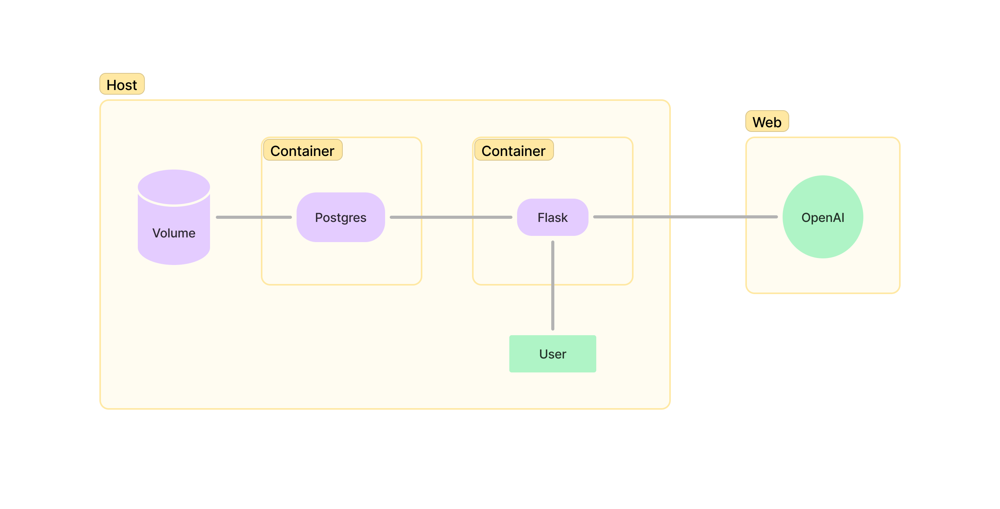
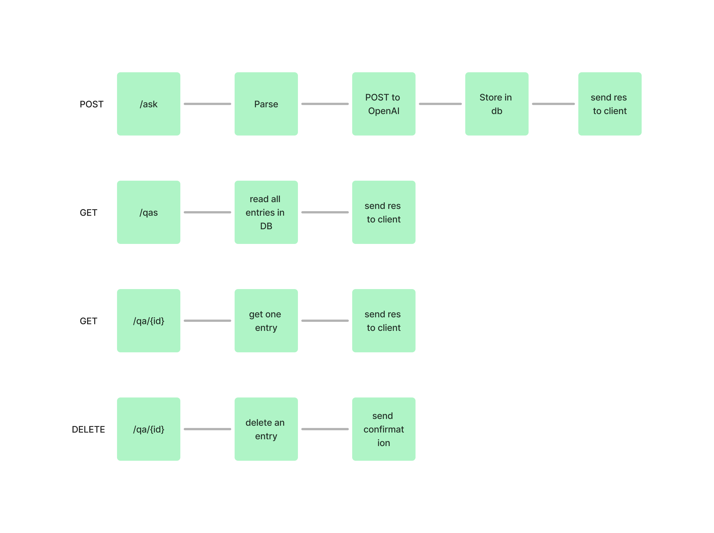

# Home Assignment

## Project Structure
```
├── README.md
├── docker-compose.yml
├── flask
│   ├── Dockerfile
│   ├── alembic
│   ├── entrypoint.sh
│   ├── requirements.txt
│   └── src
│       ├── __init__.py
│       ├── decorators.py
│       ├── models.py
│       ├── routes.py
│       ├── service_openai.py
│       └── types.py
├── res
└── tests
```

## Technologies Used
* Programming Language: Python 
* Framework: Flask
* Database: PostgreSQL
* ORM: SQLAlchemy
* Migrations: Alembic
* Testing: pytest
* Containerization: Docker
* CI: GitHub Actions

## Prerequisites
To run the project:
* Docker
* Docker Compose

To test the project:
* Python
* pytest

## Setup
Create a `.env` file from the `.env.example`

**Note** - You need to provide a valid `OPENAI_API_KEY`

## How to run
Use `docker compose` to run the project:
```
docker compose up -d --build
```


## How to test
### Install pytest dependencies
Create a virtual environment (venv)
```
 python3 -m venv .venv   
```
Activate the virtual environment
```
 source .venv/bin/activate 
```
Install dependencies
```
 pip install -r tests/requirements.txt
```

Run Tests
```
pytest tests
```

**NOTE** - In `conftest.py` make sure `port` and `host` a set to the same ones in the `docker compose`


## About The Project
### Components
* **Flask** - a web server that runs in a container.
* **OpenAI** - a service we use to generate answers to questions.
* **Postgres**
* **Volume**
<br>
<br>



### Endpoints
- **POST /ask**: Submits a question to the server.
  - **Request Body**: JSON object containing the question.
  - **Response**: Status code 200 and a JSON object.
- **GET /is_up**: Checks if the Flask server is running.
  - **Response**: Status code 200 if the server is up.
- **GET /qa/{id}**: Retrieves the question and answer for the given `id`.
  - **Response**: Status code 200 and a JSON object.
- **GET /qas/**: Retrieves all questions and answers.
  - **Response**: Status code 200 and a JSON object.


<br>

### Flows


#### Example `/ask` Post Req
```
    curl -X POST http://localhost/ask -H "Content-Type: application/json" -d  '{"question": "Who am I?"}'
```


#### Example `QuestionAnswer` Object:
```
{
    "id": int
    "question": string
    "answer": string
    "created_at": string
}
```

## Development Tools
### Adding migrations
First, change a model in `modals.py`, then run:
```
docker exec -it flask alembic revision --autogenerate -m "<MESSAGE>"
```
### Running migrations
```
docker exec -it flask alembic upgrade head
```

## CI
The `CI` is GitHub Actions. It generates a `.env` file with a secret OpenAI token.<br>
Then builds the project and runs it with `docker compose`.<br>
It runs some basic tests with `pytest`.
On failure, it prints the logs of the `flask` container.
